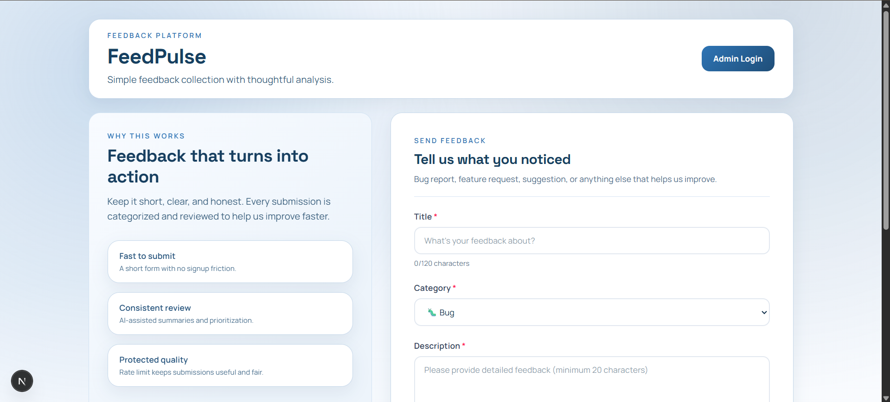
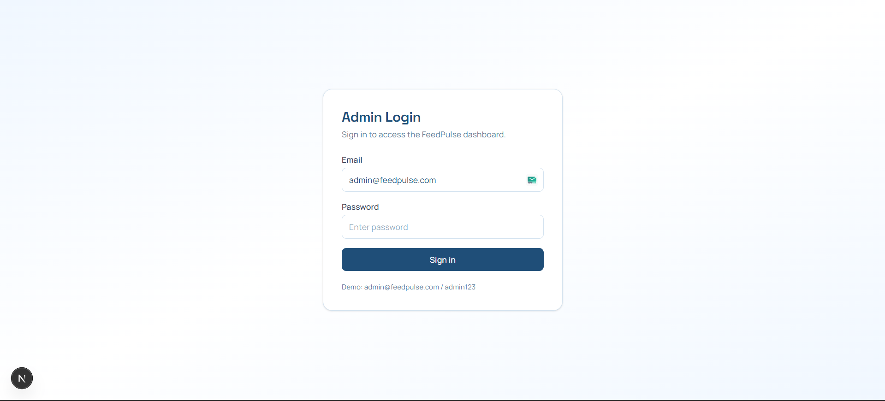
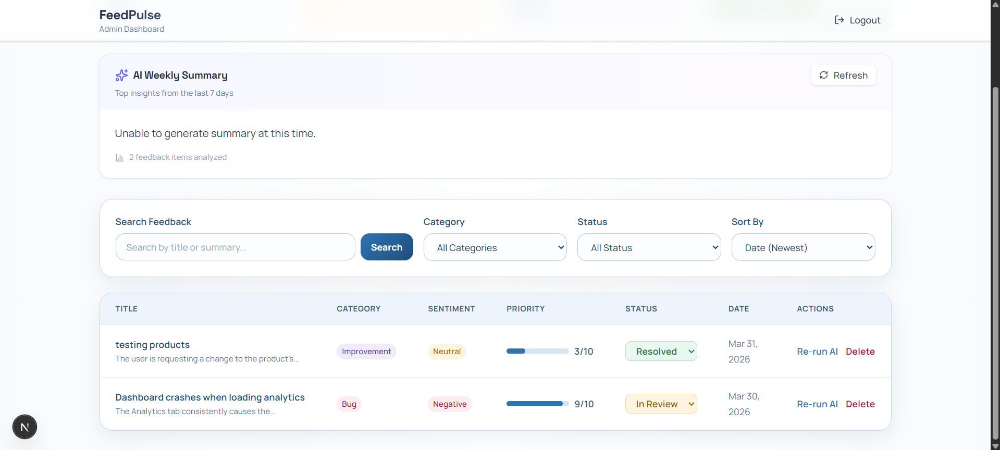

# FeedPulse

FeedPulse is an AI-assisted product feedback platform. It provides a public feedback form for collecting bug reports and feature requests, and an authenticated admin dashboard for triaging submissions with AI-generated categorization, sentiment, priority scoring, tags, and weekly trend summaries (Gemini).

## Tech Stack

**Frontend**
- Next.js (App Router) + React
- TypeScript
- Tailwind CSS

**Backend**
- Node.js + Express
- TypeScript
- MongoDB + Mongoose
- JWT authentication
- Gemini integration via Google GenAI SDK (`@google/genai`)

## How to Run Locally (Step-by-Step)

### 0) Prerequisites
- Node.js 18+ (recommended)
- A MongoDB instance (local or MongoDB Atlas)
- (Optional) Gemini API key for AI features

> Note: Env files are ignored by Git (`backend/.gitignore` and `frontend/.gitignore`).

### 1) Backend setup (API)

1. Open a terminal and go to the backend:
	```bash
	cd backend
	```

2. Install dependencies:
	```bash
	npm install
	```

3. Create `backend/.env`:

	**Recommended (matches the frontend default API URL):**
	```env
	# Required
	MONGODB_URI=mongodb://127.0.0.1:27017/feedpulse
	JWT_SECRET=change_me_to_a_long_random_string

	# Recommended (frontend defaults to http://localhost:5000)
	PORT=5000

	# Optional (demo admin login)
	ADMIN_EMAIL=admin@feedpulse.com
	ADMIN_PASSWORD=admin123
	JWT_EXPIRES_IN=7d

	# Optional (enables AI analysis + weekly summary)
	GEMINI_API_KEY=
	GEMINI_MODEL=gemini-3-flash-preview
	```

4. Start the API in dev mode:
	```bash
	npm run dev
	```

5. Verify it’s running:
	- Health check: http://localhost:5000/health

> If you don’t set `PORT=5000`, the backend defaults to `4000`. In that case, set `NEXT_PUBLIC_API_URL=http://localhost:4000` on the frontend.

### 2) Frontend setup (Next.js)

1. Open a second terminal and go to the frontend:
	```bash
	cd frontend
	```

2. Install dependencies:
	```bash
	npm install
	```

3. (Optional) Create `frontend/.env.local` if your backend is not on port 5000:
	```env
	NEXT_PUBLIC_API_URL=http://localhost:4000
	```

4. Start the frontend:
	```bash
	npm run dev
	```

5. Open the app:
	- Home (feedback form): http://localhost:3000
	- Admin login: http://localhost:3000/admin/login
	- Admin dashboard: http://localhost:3000/admin/dashboard

## Environment Variables

### Backend (`backend/.env`)

| Name | Required | Default | Purpose |
| --- | --- | --- | --- |
| `MONGODB_URI` | Yes | — | MongoDB connection string used by the API |
| `JWT_SECRET` | Yes | — | Secret used to sign/verify JWTs for admin requests |
| `PORT` | No | `4000` | API port (set to `5000` to match the frontend default) |
| `ADMIN_EMAIL` | No | `admin@feedpulse.com` | Demo/admin login email (hardcoded check) |
| `ADMIN_PASSWORD` | No | `admin123` | Demo/admin login password (hardcoded check) |
| `JWT_EXPIRES_IN` | No | `7d` | JWT expiration (e.g. `12h`, `1d`, `7d`) |
| `GEMINI_API_KEY` | No | — | Enables Gemini analysis and weekly summaries |
| `GEMINI_MODEL` | No | `gemini-3-flash-preview` | Gemini model name |
| `NODE_ENV` | No | — | When `development`, API errors may include stack traces |

### Frontend (`frontend/.env.local`)

| Name | Required | Default | Purpose |
| --- | --- | --- | --- |
| `NEXT_PUBLIC_API_URL` | No | `http://localhost:5000` | Backend base URL used by the Next.js app |

## Screenshots

### Feedback Form


### Admin Login


### Admin Dashboard


## Notes

- AI analysis is triggered asynchronously after feedback submission. If `GEMINI_API_KEY` is not set, feedback still saves normally, but AI fields will remain empty.
- Admin routes require `Authorization: Bearer <token>` after logging in.
